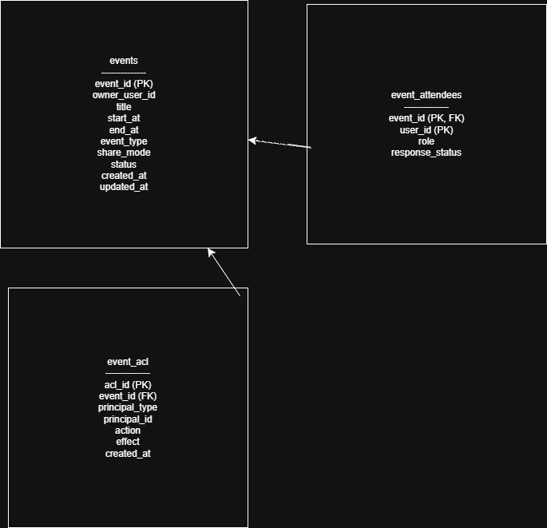

# School Calendar ACL Mini (Express + SQLite)

교육 현장에서 일정(수업/회의/행사) 운영과 공유 과정에서 발생하는 **권한 충돌/공유 범위 문제**를 백엔드 관점에서 단순화해,
**이벤트(Event)와 권한 정책(ACL)을 분리**한 최소 API를 설계·구현했습니다.

- 핵심: **데이터(이벤트)와 정책(권한)을 분리**하여 공유 정책을 DB 규칙으로 표현
- 구현: **VIEW/EDIT 권한 체크**, **부서 단위 공유**, **Demo UI로 동작 검증**

---

## Demo UI

서버 실행 후 브라우저에서 확인:
- http://localhost:3000/

> 실제 인증 대신 헤더(`x-user-id`, `x-dept-id`, `x-org-id`)로 사용자 컨텍스트를 전달합니다.

---

## Features

- 일정 생성 / 조회 / 수정(PATCH)
- ACL 기반 공유(사용자/부서/조직 단위, **ALLOW-only**)
- 권한 체크
  - `VIEW`: `VIEW` 또는 `EDIT` 권한이 있으면 허용 (**EDIT ⊇ VIEW**)
  - `EDIT`: `EDIT` 권한이 있으면 허용
- 참석자 테이블(event_attendees) 포함 (향후 `ATTENDEES_ONLY` 정책 확장 대비)

---

## Tech Stack

- Node.js
- Express
- SQLite (file DB)
- Static serving for Demo UI (public/index.html)

---

## Data Model (ERD)



### tables
- `events` : 일정 도메인 데이터(제목/시간/유형/공개 모드)
- `event_acl` : 권한 정책 레이어(누가 어떤 action을 할 수 있는지)
- `event_attendees` : 참석자(향후 참석자 기반 접근정책 확장 대비)

---

## Architecture Decision

### 1) 이벤트와 권한 정책을 분리 (events vs event_acl)
일정 데이터 자체와 공유/권한 정책을 분리하여,
권한 요구사항이 늘어나도 `events` 구조 변경 없이 **ACL 규칙을 추가**하는 방식으로 확장할 수 있도록 설계했습니다.

### 2) 권한 계층 단순화 (EDIT ⊇ VIEW)
권한 판정 로직을 단순화하기 위해 `EDIT`가 `VIEW`를 포함하도록 설계했습니다.
- 조회는 `VIEW` 또는 `EDIT`가 있으면 허용
- 수정은 `EDIT`가 있어야 허용

### 3) Actor Context 전달 방식 (Demo)
포트폴리오 목적상 인증 구현을 최소화하고,
요청 헤더로 actor 컨텍스트를 전달하여 권한 체크 로직을 명확히 검증할 수 있게 했습니다.

---

## API

- `POST /events` : 일정 생성
- `GET /events/:id` : 일정 조회 (권한 체크 포함)
- `PATCH /events/:id` : 일정 수정 (EDIT 권한 필요)
- `POST /events/:id/acl` : ACL 규칙 추가 (EDIT 권한 필요)
- `POST /events/:id/attendees` : 참석자 추가 (EDIT 권한 필요)
- `GET /health`

---

## Auth (Demo Headers)

요청 헤더로 사용자 컨텍스트 전달:

- `x-user-id` (required)
- `x-dept-id` (optional)
- `x-org-id` (optional)

예)
- 부서 10 사용자: `x-user-id: 3`, `x-dept-id: 10`, `x-org-id: 100`

---

## Run

```bash
npm i
node server.js

## What I focused on
- 일정 데이터(events)와 권한 정책(event_acl)을 분리해 공유 규칙을 DB로 표현했습니다.
- 조회는 VIEW/EDIT 허용, 수정은 EDIT만 허용하도록 단순한 계층(EDIT ⊇ VIEW)로 설계했습니다.
- Demo UI는 버튼으로 API를 호출해 권한 시나리오를 빠르게 검증할 수 있게 구성했습니다.


